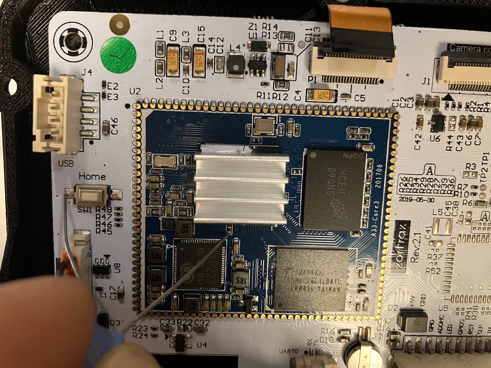

# sunxiSPL_to_uboot_proper

A script to pack uboot proper in a structure recognised by sunxi u-boot SPL.

## Why?

On some Allwinner systems, you do not have a SDcard port or multiple ways of booting. But you have more or less the FEL mode in the MMC BOOT0 zero sector to start u-boot using sunxi-fel form a remote computer.

If you flash mainline u-boot in emmcblkBoot0 and it fails, you have a brick.
And the old sunxi SPL, while having the nice FEL feature, does not load mainline u-boot.
Allwinner released the source code of their bootloader.
https://github.com/allwinner-zh/bootloader.git

The tool takes the sunxi boot1 data format, and embedds a recent u-boot in this sunxi legacy secondary boot image format.

* You keep FEL mode (using a different approach)
* You do not take risks with mmcblkBoot0
* You boot mainline u-boot and take control of your device.

## Change u-boot

You must change the text base of mainline u-boot to start at the end of the sunxi header:
Add this line to your defconfig:
```
# Sunxi boot
CONFIG_TEXT_BASE=0x4a000500
```
Warning: tested only on allwinner A33, other machines may differ.

## Usage

You only pack the u-boot binary. To pack the binary into a Sunxi secondary boot:
```
python3 sunxisecondstagetool.py u-boot u-boot-dtb.bin out.bin
```
"u-boot" is only here to check that the text base address has been shifted.

To write it on the target:
```
sudo dd if=out.bin of=/dev/mmcblk2 bs=512 seek=38192
or if mounted as ums drive
sudo dd if=out.bin of=/dev/sdX bs=512 seek=38192
```

Visual check:
```
sudo dd if=/dev/mmcblk2 bs=512 skip=38192 count=2 status=none | hexdump -C
```

## Bricked?

If as on MY A33 system, you only have a EMMC, and you bricked it. A trick is to put in contact the EMMC CLK 33R resistor and GND through a 100nF capacitor at powerup. This will render the clock trace ineffective without destroying it and mask the EMMC from the Allwinner A33. The chip will start in FEL mode.



You can figure ou the pin using the A33 pin description or find a schematic.

## History

On my A33 system, I was losing the FEL mode if I wrote u-boot mainline over the Boot0 partition. And I bricked my device twice, I repaired it by replacing the EMMC chip.
I needed a way to load u-boot from EMMC and while FEL mode worked wel, the method of chainloading u-boot from sunxi Boot1 was not satisfying. With a missing emmc, and some problems at panel init compared to the u-boot loaded using FEL mode.
After a day of trying what I could think of to load a mainline Linux using the legacy Boot1, I stumbled upon the Boot0 source code from Allwinner and made this tool (drafted using AI code, hence python, I worked on the checksum and added a TEXT segment check at the end).
And I lost my commits, because after I brciked my printer, I decided to delete the repo finding it too dangerous.
And then figured out how to make it work but my cp command ignored the git files...

## TODO

This tool has harcoded values for Alwinner A33. It could be better to copy those values from the original data.
